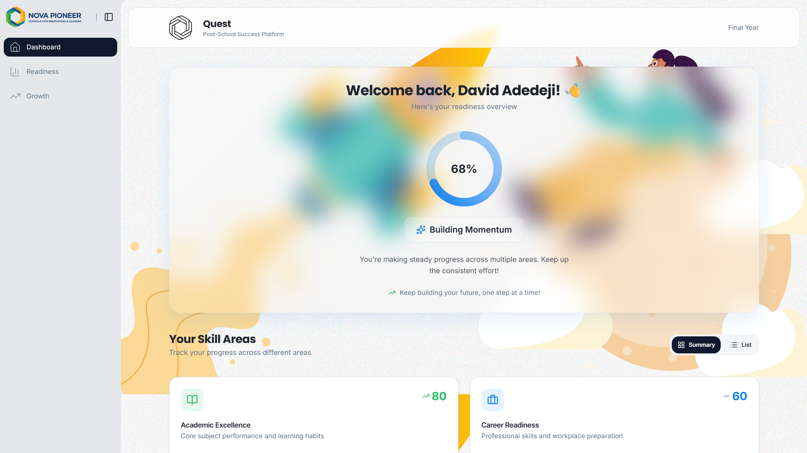

# Quest Learner Readiness Dashboard


[Live Demo](https://your-vercel-link.vercel.app)

### Overview

This project implements a learner-facing readiness dashboard for Quest, Nova Pioneer’s Post School Success Platform.

It visualizes a learner’s overall readiness score, skill breakdown, and recommended next steps in a mobile-first experience designed for 15–18 year olds.

## Tech Stack
```
Next.js 16
React
TypeScript
TailwindCSS
Dummy JSON data (no backend)
```

### Getting Started
```bash
npm install
npm run dev
```
### Open:
```bash
http://localhost:3000
```
### To build for production:
```bash
npm install
npm run dev
```
### Project Structure
```
/data/readiness.json
```
Static mocked readiness data used to simulate API response.
```
/lib/readiness-data.ts
```
Data access layer that abstracts the data source.
This allows swapping JSON for a real API later without refactoring UI components.

```
/utils/readiness.ts
```
Domain types and shared readiness models.
```
/utils/readiness-calculator.ts
```
Business logic for computing readiness level, insights, and derived values.
```
/components
```
UI components, including:

```
ReadinessScore
ProgressRing
SkillCard
DetailedView
AppShell
```
The UI layer is intentionally separated from business logic.

# Design Decisions
## Visual Language

Glassmorphism cards for clarity and focus

Soft white gradients inspired by Nova Pioneer colors

Circular progress ring as primary readiness anchor

Achievement badge to reinforce progress

## Mobile-First Approach

Responsive layout optimized for small screens

Clear vertical hierarchy

Generous spacing for readability

## Interaction Design

Toggle between summary and detailed views

Clickable skill areas with deeper insight pages

Animated transitions to improve continuity

Dynamic insights generated client-side

## Insight Logic

Insights are computed client-side using simple rules:

Identify strongest skill area

Identify lowest scoring area

Generate focus recommendation

This logic can be replaced by API-provided insights in future iterations.

## Assumptions

Readiness data is precomputed server-side.

Scores range from 0–100.

No authentication required for this task.

## Extension Ideas

Real API integration

Persistent learner accounts

Activity recommendation engine

Gamification elements

PWA offline support

Performance monitoring and analytics

# Loom

[Insert Loom Link Here]
